# 🚀 Enterprise Azure Landing Zone Governance & Continuous Compliance Automation

Enterprise-grade Azure Governance implementation using Terraform, Azure Policy, Governance Guardrails, Compliance Monitoring, and Policy-as-Code principles to standardize, secure, and continuously monitor Azure cloud environments.

---

## 📌 Project Overview

This project demonstrates an enterprise Azure Governance platform designed using Terraform, Azure Policy, Azure Monitor Workbooks, and governance guardrails.

The implementation automates governance controls, compliance visibility, resource standardization, and cloud security enforcement while following enterprise cloud governance practices.

---

## 🏗 Enterprise Governance Architecture

Azure Subscription

↓

Terraform Remote Backend

↓

Terraform Policy Deployment

↓

Azure Policy Assignments

↓

Azure Initiative Definition

↓

Governance Enforcement

↓

Compliance Evaluation

↓

Azure Monitor Workbook

↓

Compliance Dashboard

↓

Governance Reporting

---

## ⚙ Technology Stack

| Technology | Purpose |
|------------|----------|
| Microsoft Azure | Cloud Platform |
| Terraform | Infrastructure Automation |
| Azure Policy | Governance Controls |
| Azure Monitor | Compliance Monitoring |
| Azure Resource Graph | Governance Analytics |
| GitHub Actions | CI/CD Automation |
| Azure Storage Account | Terraform Backend |
| Azure Workbooks | Dashboard Visualization |
| Azure Management Groups | Subscription Governance |

---

## 🔥 Enterprise Governance Features

✅ Policy-as-Code Implementation

✅ Terraform Remote State Backend

✅ Governance Initiative Definition

✅ Compliance Dashboard

✅ Region Restriction Governance

✅ VM SKU Restriction Controls

✅ Mandatory Resource Tagging

✅ Storage Security Governance

✅ Subscription Governance

✅ Continuous Governance Monitoring

---

# 📸 Implementation Screenshots

## Terraform Backend Deployment

---

## Storage Backend Configuration

---

## Policy Definition Configuration

### Basic Configuration

### Tag Parameters

### Review Configuration

---

## Policy Assignment Configuration

### Assign Policy

### Scope Selection

### Advanced Settings

### Assignment Summary

---

## Policy Enforcement

---

## Governance Validation Steps

### Validation Flow

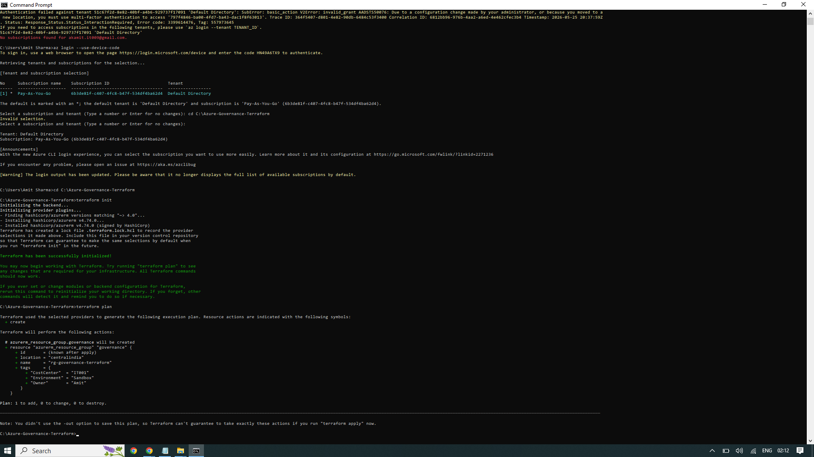

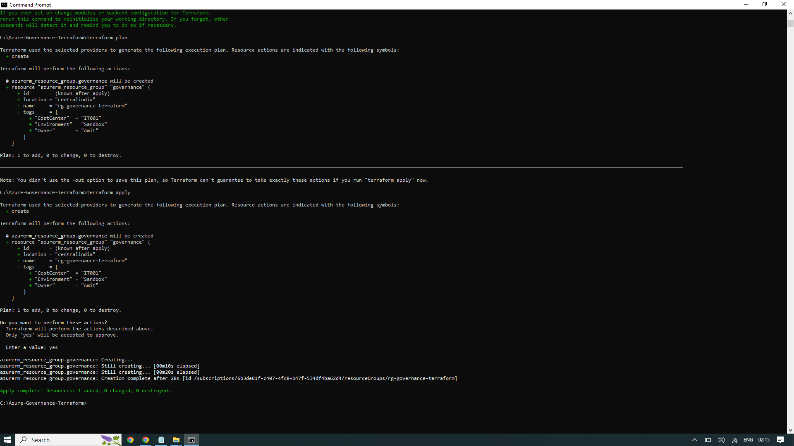

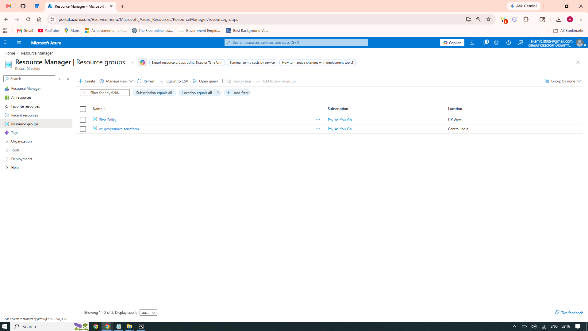

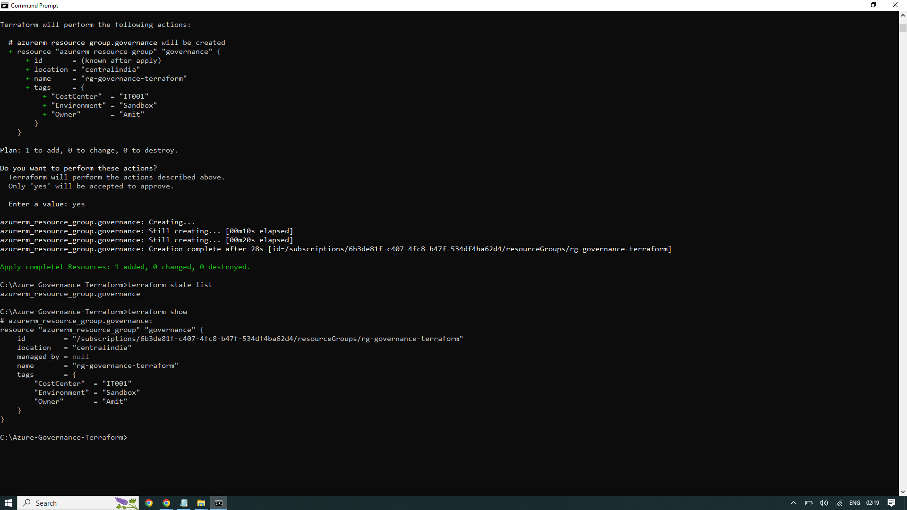

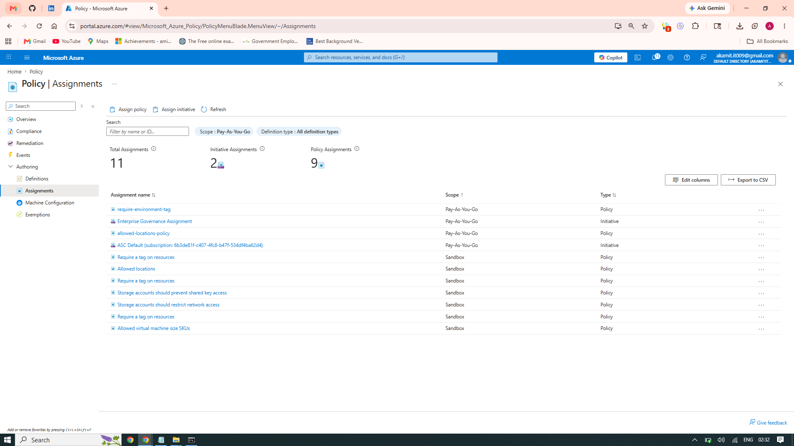

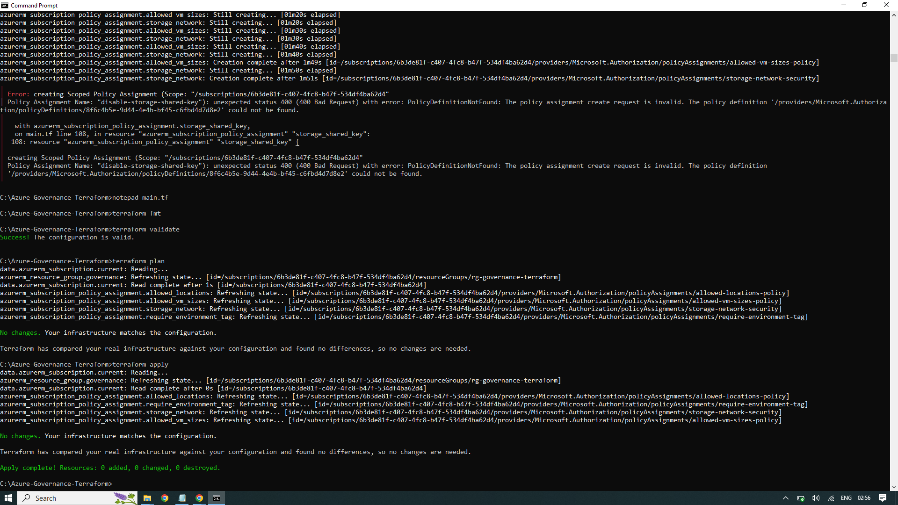

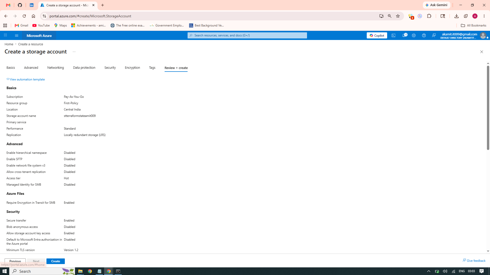

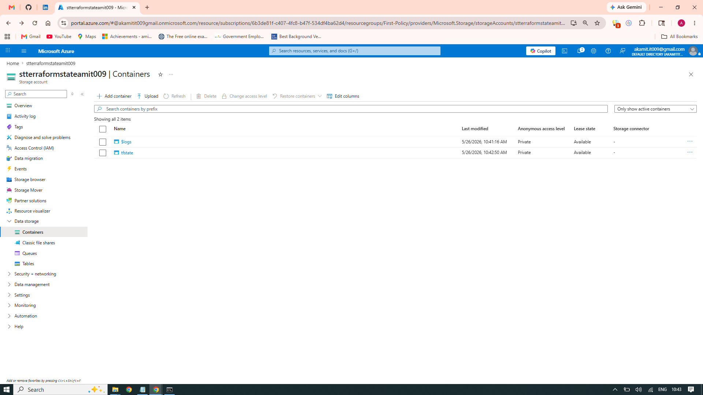

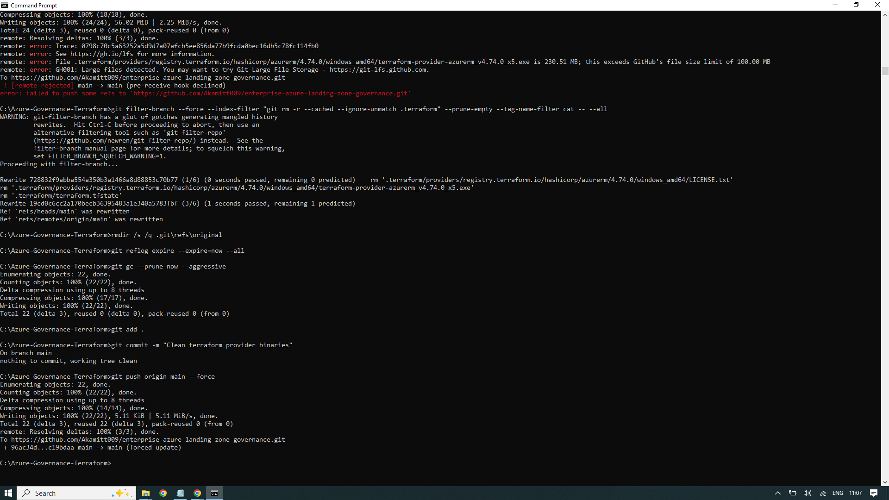

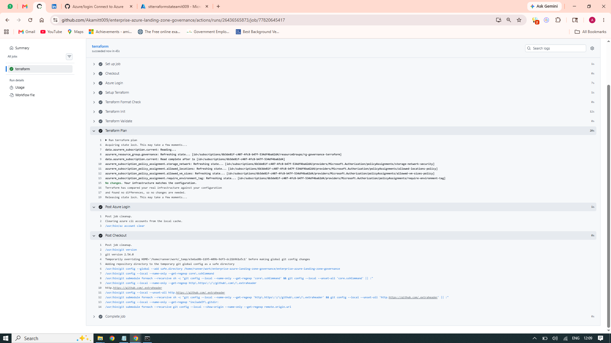

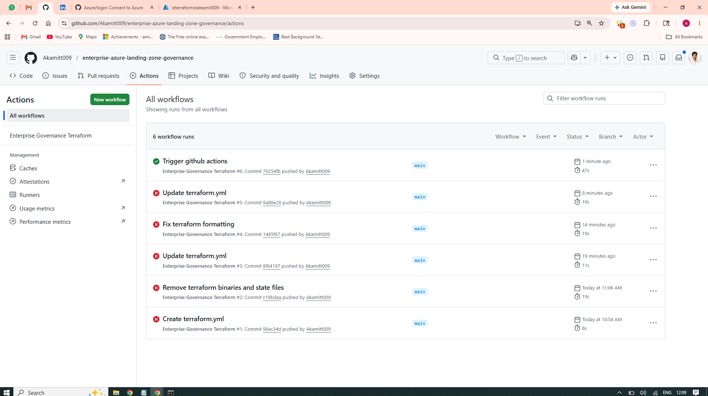

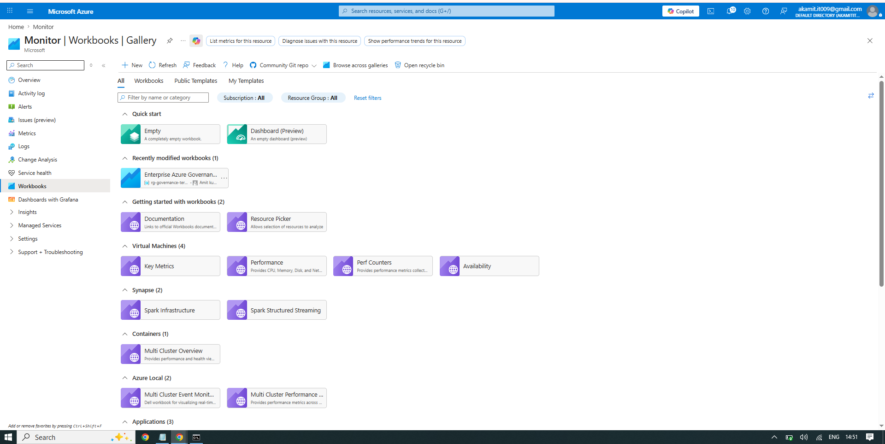

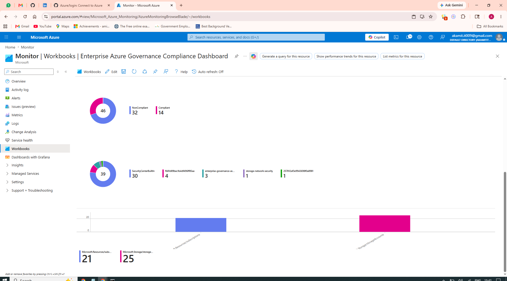

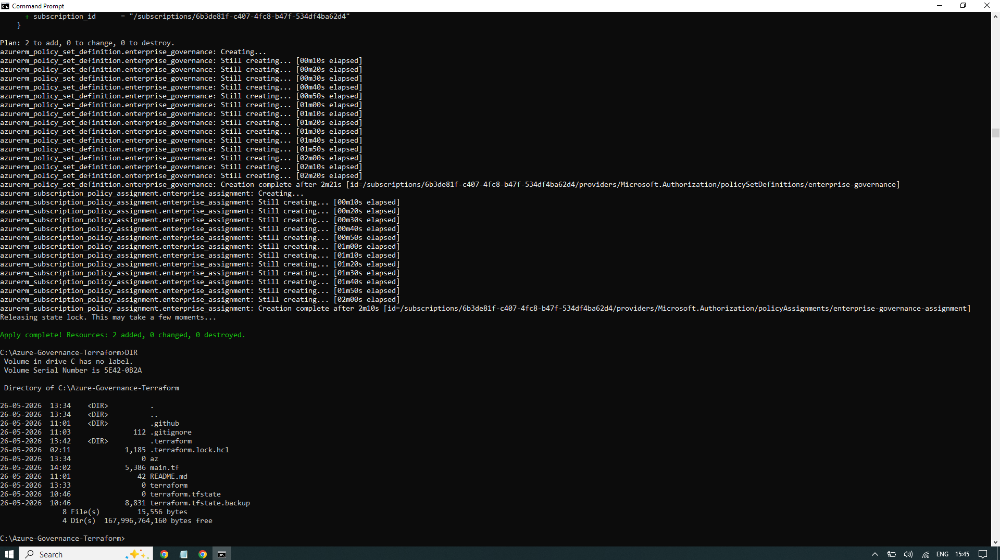

---

## Additional Outputs

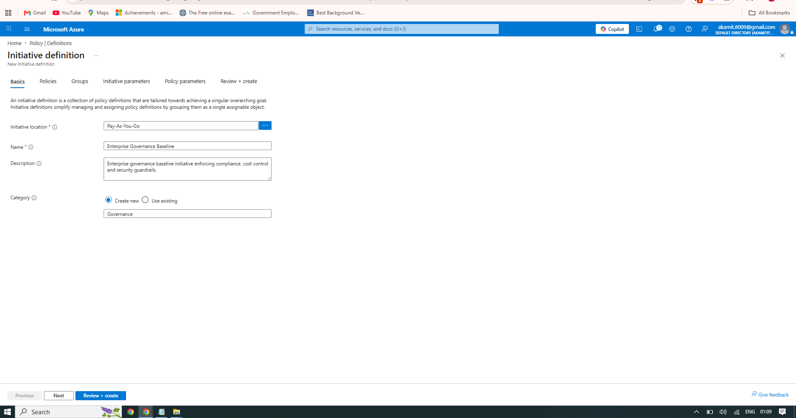

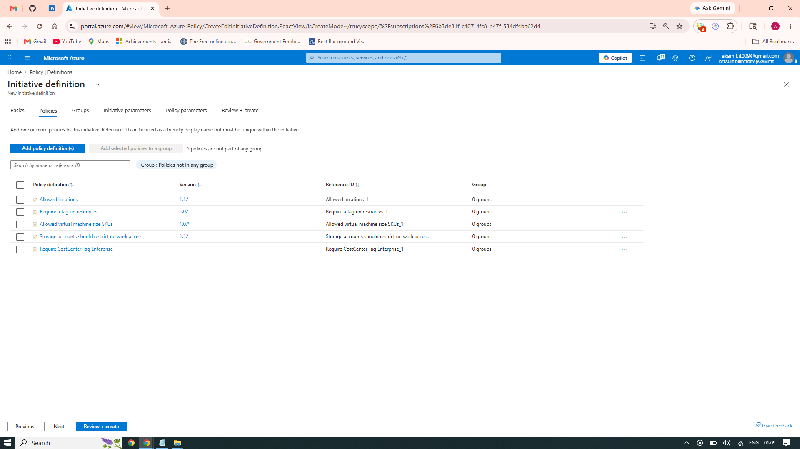

---

## 🛡 Security Controls

Implemented:

- Azure Policy Governance
- Region Restrictions
- Resource Tag Enforcement
- VM SKU Governance
- Storage Network Controls

Future Improvements:

- Defender for Cloud Integration
- DeployIfNotExists Automation
- Key Vault Integration
- Custom Policy Definitions

---

## 📈 Business Impact

Reduced:

- Manual governance effort
- Configuration drift
- Policy violations
- Governance inconsistencies

Improved:

- Compliance visibility
- Governance posture
- Standardization
- Operational consistency

---

## 🧠 Skills Demonstrated

Azure Governance

Terraform

Infrastructure as Code

Azure Policy

Cloud Compliance

Azure Monitor

Governance Automation

CI/CD Integration

Cloud Security Controls

Enterprise Cloud Operations

Troubleshooting

Policy-as-Code

---

## 👨‍💻 Author

**Amit Kumar**

Azure Administrator | Cloud Infrastructure Engineer | Azure Governance Enthusiast

GitHub:

https://github.com/Akamitt009

---

⭐ If you found this project valuable, give it a star.
